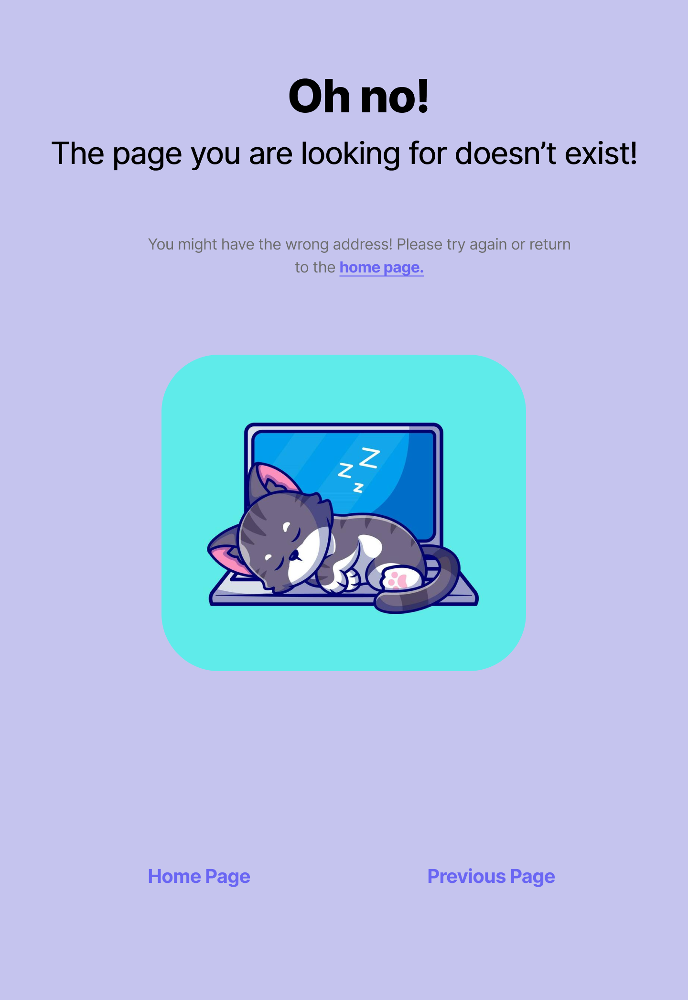

# Preference Page
Page Description:  
* The Preference Page empowers users to tailor their recipe recommendations to their dietary restrictions and preferred cuisines. This page provides a user-friendly interface for users to specify their dietary restrictions and preferred cuisines.  

Parameters Needed:  
* User ID: To link the user's preferences with their account and ensure personalized recommendations.

Data Needed to Render the Page:  
* User's existing dietary restrictions and preferred cuisines (if available)  
* A list of dietary restriction options (e.g., vegetarian, vegan, gluten-free)  
* A list of cuisine options (e.g., Italian, Mexican, Chinese)  

Link Destination:  
* Be able to navigate to Vault page  
* Be able to navigate to Search page  
* Be able to navigate back to user's profile page  
* Be able to navigate to other pages on website through other links provided/generated as needed through development of website  

Tests for Verifying Rendering:  
* Verify that the user's existing preferences (if available) are pre-selected in the form.  
* Test the functionality of the dietary restriction and cuisine selection interfaces.  
* Ensure that any changes to preferences are saved when the form is submitted.  
* Verify that updated preferences result in tailored recipe recommendations on other parts of the application.  
* Verify user can navigate to other portions of website from this page.  

# Login Page
Page Description:  
* Allows users to login to their existing account, has links to sign up as well.

Parameters Needed:  
* First and Last Name
* Username (must be Unique)
* Email
* Password
* Phone Number (optional)

Data Needed to Render Page:
* Dimensions of login/signup page
* Dimensions of input boxes
* Input box titles
* Input box placeholder text
* Colors
* Page title
* Fonts 
* List of existing users including usernames

Link Destinations:  
* Sign-up: extra text boxes to sign up vs. login
* Login: takes user to their VAULT PAGE

Tests for Page: 
* Ensure that login page opens upon visiting site
* Ensure sign-up button adds extra text boxes for info
* Ensure correct formatting for all text box inputs ( i.e. phone number, email has @, etc.
* Ensure unique username, phone number to prevent duplicate accounts

# Vault Page: 
Page Description:  
This page displays a users saved recipes and categories.

Parameters Needed:  
* User’s recipes
* User preferences(Organization, Name, Colors, Settings, Categories)

Data Needed for Rendering:  
* Dimensions of recipe tiles
* Dimensions of page header
* Dimensions of Search bar
* Dimensions of side menu
* Filtering options
* User information
* User recipes
* Recently accessed recipes
* Recipe info for each recipe tile
* Category Separation

Link Destinations:
* Can return to Home page
* Can go to Search/Explore page
* Can pop up error pages if occurring

Tests for Page: 
* Test links to other pages
* Test adding/removing recipes and categories
* Ensure that all added recipes are present
* Ensure that user information and preferences are displayed correctly
* Ensure HTML/CSS elements are displayed correctly
* Ensure that errors pop up when necessary

# Search Page:

Page Description:  
On this page, users can browse recommended/popular recipes, and search for new ones with filtering

Parameters Needed:  
* List of recipes by popularity
* User preferences
* Username visible
* Colors
* Settings
* Available filters
* Sort-by categories
* User vault page link to save to

Data Needed for Rendering:  
* Dimensions of recipe tiles
* Dimensions of page header
* Dimensions of Search bar
* Dimensions of side menu
* Filtering options
* User information
* Popular recipe (sorted list)
* Recipe info for each recipe tile
* Category information for each recipe
* User saved recipes

Link Destinations:  
* Can return to Home page
* Can go to login page
* Can go to vault page
* Can pop up error pages if occurring

Tests For Page:  
* Test links to other pages
* Test adding/removing recipes to vault page
* Test search function and recipe tags/categories
* Ensure that user information and preferences are displayed correctly
* Ensure HTML/CSS elements are displayed correctly
* Ensure that errors pop up when necessary

# Recipe Page:

Page Description:  
* The Recipe Page displays a give recipe and all the information required to make that recipe. Users are also able to rate the recipe, save the recipe, and leave a comment if the wish to. 

Parameters: 
* User ID 
  - Needed to link the users rating of the meal to their account to influence personalized recommendations 
  - Needed so that user can save recipe to their unique vault if they want to 
 

Data Needed to Render Page:  
* Recipe Titles
* Recipe prep time
* Recipe cook time
* Recipe serving size
* List of ingredients needed for recipe
* Cooking Instructions
* Comments previously posted on recipe

Links to other Destinations: 
* Link to Vault page
* Link to Search page
* Link back to user's profile page
* Links to any other pages deemed necessary during development of website

Tests to Verify Rendering: 
* Ensure that when another destination is selected, the link works and the user is taken to the correct page.
* Test the functionality of one user leaving a comment and it still being there when another user views the same recipe.
* Ensure that any changes to ratings remain after the user leaves the page
* Verify that a new or updated rating will influence the recipe recommendations on other parts of the application.

# Error Page:

Page Description:  
* The error page will be used to redirect users after making a bad request or trying to use a feature they don't have access to. 

Parameters: 
* User ID needed to verify if the user has an account or not (or not logged in) 
 

Data Needed to Render Page:  
* User error type

Links to other Destinations: 
* Link to home page
* Link to previous page
* Link to create an account
* Link to login page

Tests to Verify Rendering: 
* Test to make sure links return user to previous page, home page, create an account and login page
* Test to make sure user without an account are redirected to error page stating they need an account to access said functionality

# Home Page:

Page Description:  
* The home page is the default page when the user visits the website. It will have many features to direct the user to their current needs.  

Parameters:  
* Users Saved Recipes
* Users Preferences to recommend recipes within range
* History of recently viewed recipes

Data Needed to Render Page:  
* Images and multimedia (images, descriptions and titles of recipes)
* Links to recipes

Links to other Destinations:  
* Sign-in Page
* Saved Recipes
* Trending Recipes
* Occasional Recipes
* Recipes (random recipes to browse)
* Recipe of the Day
* Recently Viewd Recipes

Test to Verify Rendering:  
* Test to make sure each destination is the correct pathway.
* Ensure search bar works properly
* Images and multimedia work correcly and are not broken

