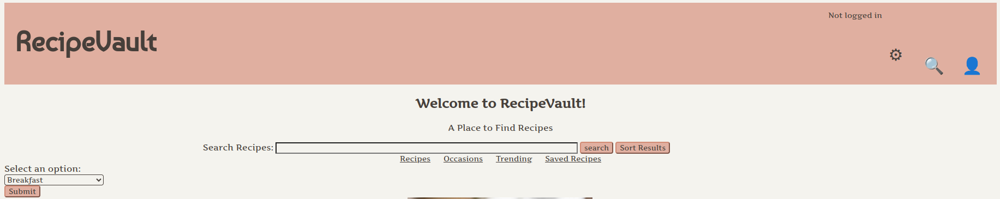
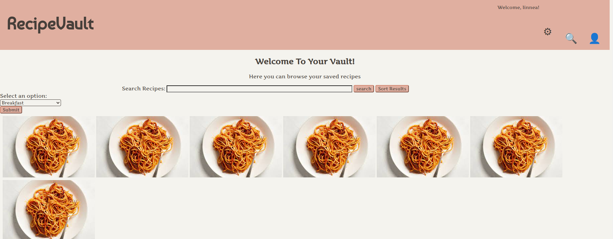

<b> Login Page </b> 
    Our routes are set such then when you start the site you are taken to the login page as shown below. If you already have an account you may sign in, other wise you can register by clicking on the "Don't have an account? Register" button. This will take you to the registerpage discussed next. If you do have an account you can login on this page and it will take you to the RecipeVault home page. 
    

 

    <b> Register Page </b> 
    If you do not already have an account, you can register by entering a desired username and password. If that username or password is already in use an error message will be displayed and you will need to choose a different one. Once you have successfully registered for an account, you will be logged in and taken to the home page. 
    

    <b> Home Page </b> 
    From the home page the user has several options, including the following: 
    - Search for a recipe (via the search bar) 
    - Go to you're saved recipes, known as the Vault (person figure in the upper right corner) 
    - Go to a seperate search page  
    The other features and buttons on this page currently don't work.
    

    <b> Vault Page </b> 
    In the user's Vault the user can see recipes they've saved, search saved recipes or sort them by preferences. The user can also return to the Home page by clicking on the RecipeVault logo. 
    

    <b> Results Page </b> 
    When a user searches for a recipe or type of food they want, say 'lunch', they will be take to a results page the will display the list of returned recipes. They can then click on the desired recipes and it will take them to that recipe's page. 
    

    <b> Recipe Page </b> 
    The recipe page displays all the necessary information for the recipes such as: list of ingredients & directions. It also has a an option to save the recipe, rate the recipe, and leave a comment for other user's to see. These mentioned features are not fully functional as of yet. Also not yet implemented is a home button, so for now you simply have to use the back button to return to the Results page to then navigate tot the Home page.
    

